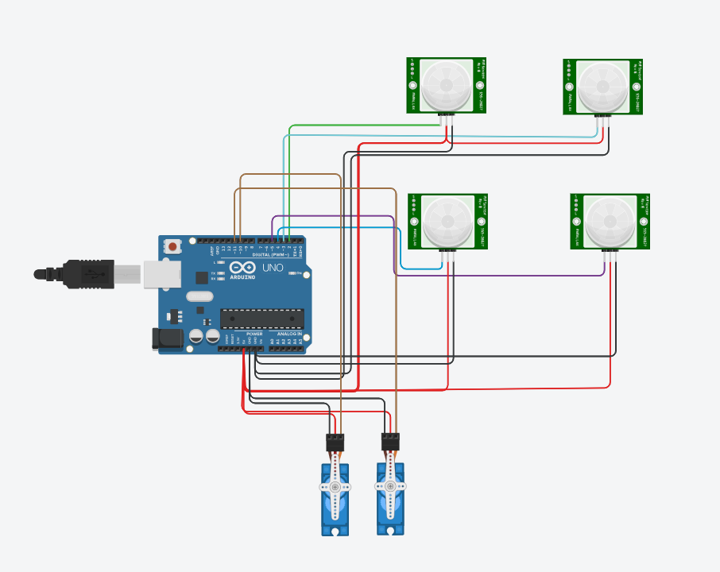

# Sun-tracking-for-solar-panel

As a part of my B.Tech, during 3rd sem we were asked to do a project for Digital System Design subject. Our team designed a sun tracking system for solar panel positioning with the help of Arduino Uno board and some electric components

# Circuit Diagram

Here, in the image i have used a PIR instead of LDR module due to the inavailability in my simulation software. You should make sure to correct the pins to the D0 pins of the LDR modules.
